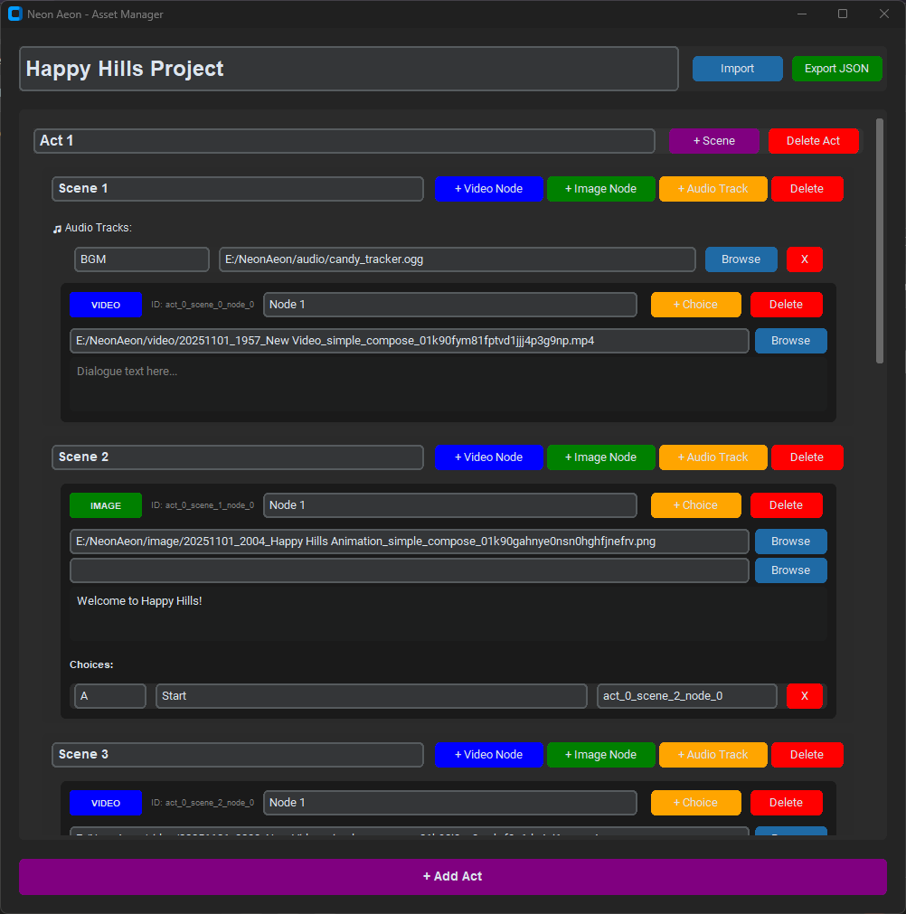

# Neon Aeon - Asset Manager

A 'proof of concept' visual asset management tool for creating interactive narrative experiences with branching video and image-based storytelling. This version uses a JSON export format which can be adapted for any game engine. Intended to be used with the Neon Aeon plugin, currently aimed at Godot.

## Overview

Neon Aeon Asset Manager helps you organize and structure complex branching narratives that combine:
- **Video sequences** for action/cinematic moments
- **Still images with audio** for dialogue and character interactions
- **Multiple audio tracks** per scene (BGM, SFX, dialogue layers)
- **Choice-driven branching** with controller button mapping
- **Hierarchical organization** using Acts → Scenes → Nodes

When combined with the Neon Aeon Plugin, you have the perfect workflow for creating interactive stories, visual novels with video elements, or experimental narrative games. Designed with the next wave of high quality video and audio GenAI in mind. 

## Screenshot



## Features

- 🎬 **Dual Content Types**: Mix video nodes and image+audio nodes in the same project
- 🎵 **Multi-track Audio**: Add multiple labeled audio tracks per scene (BGM, SFX, ambient, etc.)
- 🎮 **Controller Mapping**: Assign specific buttons to choices for console-style interactions
- 📂 **File Browser Integration**: Native file dialogs for easy asset selection
- 🌳 **Hierarchical Structure**: Organize content into Acts, Scenes, and Nodes
- 💾 **JSON Export**: Clean, readable format for integration with game engines
- 🎨 **Modern UI**: Built with CustomTkinter for a polished dark-mode interface

## Installation

### Prerequisites
- Python 3.8 or higher

### Setup

1. Clone the repository:
```bash
git clone https://github.com/yourusername/neon-aeon-asset-manager.git
cd neon-aeon-asset-manager
```

2. Install dependencies:
```bash
pip install customtkinter
```

3. Run the application:
```bash
python neon_aeon_manager.py
```

## Usage

### Getting Started

1. **Create Acts**: Start by adding acts to organize your story into major sections
2. **Add Scenes**: Within each act, create scenes for specific locations or moments
3. **Add Audio Tracks**: Set up background music, sound effects, or ambient audio for each scene
4. **Create Nodes**: Add video or image nodes for each story beat
   - **Video Nodes**: For action sequences, cutscenes, or cinematic moments
   - **Image Nodes**: For dialogue, character interactions, or static story moments
5. **Define Choices**: Add branching choices to nodes with button mappings and target nodes
6. **Export**: Save your project as JSON for use in your game engine

### Project Structure

```
Project
├── Act 1
│   ├── Scene 1
│   │   ├── Audio Tracks (BGM, SFX, etc.)
│   │   ├── Node 1 (Video)
│   │   │   └── Choices
│   │   └── Node 2 (Image + Audio)
│   │       └── Choices
│   └── Scene 2
│       └── ...
└── Act 2
    └── ...
```

### JSON Format

The exported JSON follows this structure:

```json
{
  "name": "Project Name",
  "acts": [
    {
      "id": "act_0",
      "name": "Act 1",
      "scenes": [
        {
          "id": "scene_0",
          "name": "Opening",
          "audioTracks": [
            {
              "id": "track_0",
              "label": "BGM",
              "path": "/path/to/background_music.mp3"
            }
          ],
          "nodes": [
            {
              "id": "node_0",
              "type": "video",
              "name": "Intro Cutscene",
              "videoPath": "/path/to/video.mp4",
              "choices": [
                {
                  "id": "choice_0",
                  "button": "A",
                  "text": "Investigate",
                  "targetNodeId": "node_1"
                }
              ]
            }
          ]
        }
      ]
    }
  ]
}
```

## Example Workflow

### For AI-Generated Content

1. **Plan your story structure** using the asset manager first
2. **Generate concept art** to establish visual style (Midjourney, Flux, etc.)
3. **Create character references** for consistency
4. **Generate videos** in batches using your reference images (Sora, Veo, etc)
5. **Generate dialogue audio** using text-to-speech (ElevenLabs recommended)
6. **Import file paths** into the asset manager using the browse buttons
7. **Export JSON** and integrate with your game engine plugin

### File Organization Tips

Organize your media assets to match your project structure:
```
project_assets/
├── act1/
│   ├── scene1/
│   │   ├── videos/
│   │   ├── images/
│   │   └── audio/
│   └── scene2/
│       └── ...
└── music/
    ├── bgm/
    └── sfx/
```

## Roadmap
1. Ship the Godot companion plugin (then we can start making stories).
2. Minor UX improvements for this tool (fix scrolling up when adding nodes, etc).
3. Integrate this tool into the Godot plugin.

## Contributing

Contributions are welcome! Please feel free to submit a Pull Request. For major changes, please open an issue first to discuss what you would like to change. Bear in mind that is is just a solo hobby project for me right now so I may not response immediately, or at all in some cases. Also let me know if you make any games using this tool as I would love to play them.

## License

MIT License - see LICENSE file for details

## Acknowledgments

Built for hobbist game developers, narrative designers, and interactive storytellers who want to experiment with pre-generated AI video-driven branching narratives.

## Support

If you encounter any issues or have questions:
- Open an issue on GitHub
- Check existing issues for solutions
- Contribute improvements via pull requests

---

**Note**: This tool manages project structure and exports JSON. You'll need a separate game engine plugin (Godot, Unity, Unreal, etc.) to actually play back the interactive experience. A companion Godot plugin is being actively developed right now.